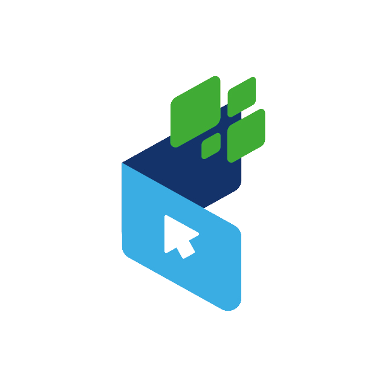
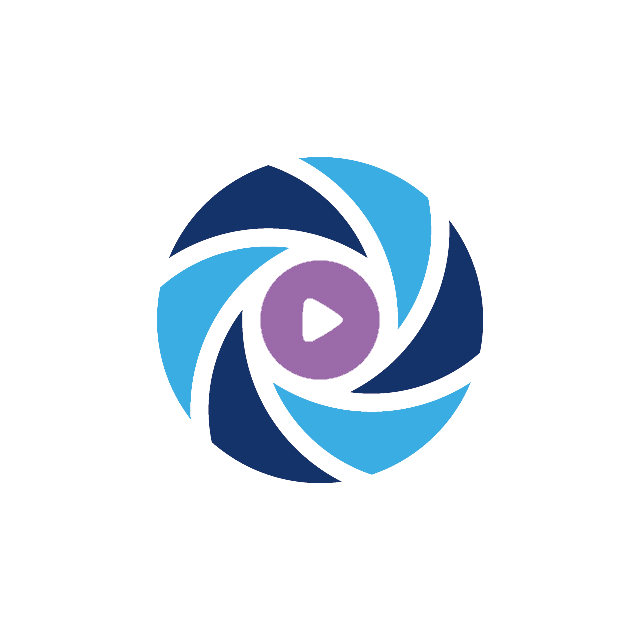
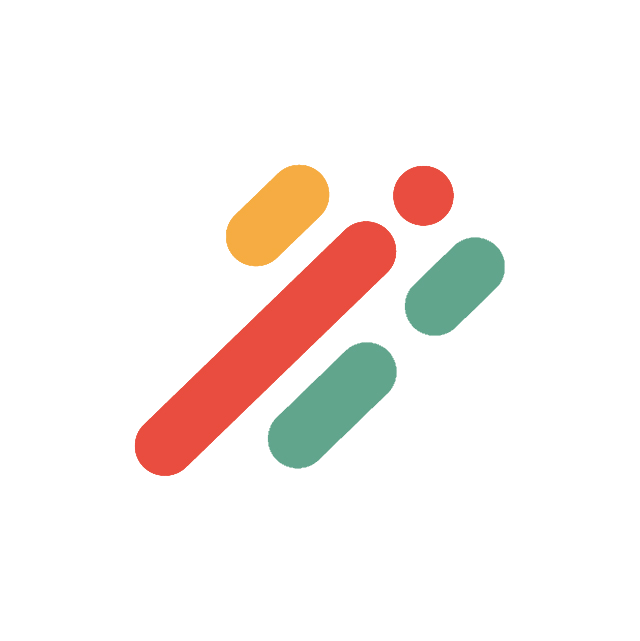
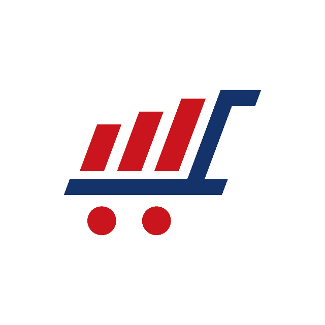
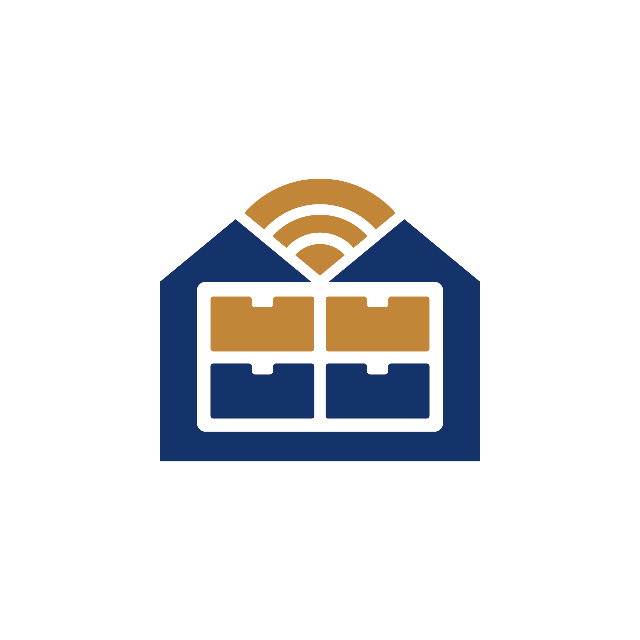
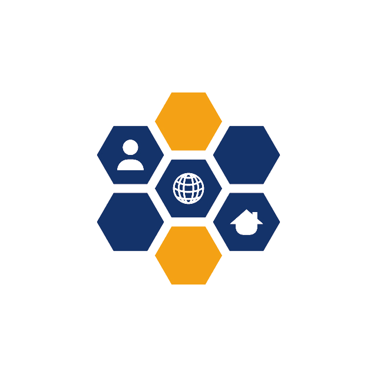
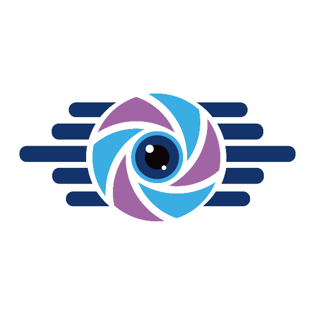
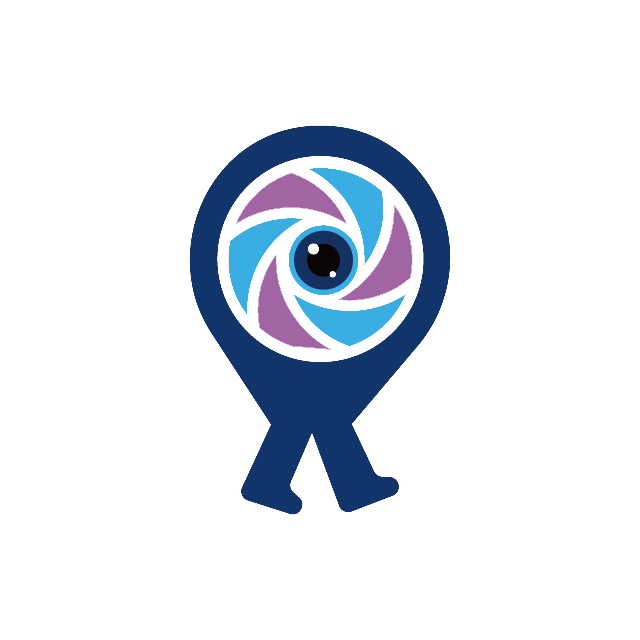

<div align="center">

<p align="center">
  
</p>

<p align="center">
  <strong>Choose your language</strong><br>
  <a href="./README.md" title="English"></a>
  <a href="./README.id.md" title="Indonesia"></a>
  <a href="./README.zh-tw.md" title="繁體中文"></a>
  <a href="./README.zh-cn.md" title="简体中文"></a>
  <a href="./README.ja.md" title="日本語"></a>
  <a href="./README.ko.md" title="한국어"></a>
  <a href="./README.de.md" title="Deutsch"></a>
  <a href="./README.fr.md" title="Français"></a>
  <a href="./README.es.md" title="Español (current language)"></a>
  <a href="./README.it.md" title="Italiano"></a>
  <a href="./README.pt-br.md" title="Português"></a>
</p>


<sub>Estrategia · Software · SaaS · Tecnología creativa · Educación · Comunidad</sub>

<a href="https://sophistec.global/" target="_blank" rel="noopener noreferrer">
  
</a>
<a href="https://github.com/sophistec-solutions" target="_blank" rel="noopener noreferrer">
  
</a>
<a href="https://bio.sophistec.global/bio-sophistec-global/" target="_blank" rel="noopener noreferrer">
  
</a>

</div>

---

## Construimos lo que ayuda a las personas y a las empresas a avanzar.

**Sophistec Global** es un ecosistema multidisciplinario que reúne estrategia empresarial, desarrollo de software, productos SaaS, medios creativos, educación y comunidades.

Ayudamos a fundadores, organizaciones y comunidades a convertir ideas en soluciones prácticas: desde productos digitales y sistemas operativos integrados hasta historias con propósito, plataformas de aprendizaje y programas colaborativos.

<p align="center">
  
</p>

## Nuestras empresas y marcas

| Logo | Marca | Qué hace | Explorar |
| :---: | --- | --- | --- |
|  | **Sophistec Global** | Consultoría para la entrada al mercado de Indonesia, constitución de empresas, Employer of Record (EOR), apoyo a la contratación local, facilitación de inversiones y expansión empresarial transfronteriza. | <a href="https://sophistec.global/" target="_blank" rel="noopener noreferrer">Explorar</a> |
|  | **Sophistec Dev House** | Desarrollo de software a medida, aplicaciones móviles, integración de API, IA, automatización, nube, datos, UI/UX y equipos tecnológicos. | <a href="https://devhouse.sophistec.global/" target="_blank" rel="noopener noreferrer">Explorar</a> |
|  | **Sophistec Academy** | Aprendizaje, formación ejecutiva, educación para fundadores y programas de intercambio de conocimientos. | <a href="https://academy.sophistec.global/" target="_blank" rel="noopener noreferrer">Explorar</a> |
|  | **Sophistec Studio** | Tecnología creativa, fotografía, videografía, documentación de eventos y experiencias de marca. | <a href="https://studio.sophistec.global/" target="_blank" rel="noopener noreferrer">Explorar</a> |
|  | **Sophistec Growth Hub** | Marketing estratégico, relaciones públicas, redes sociales, crecimiento de marca y participación comunitaria. | <a href="https://growthhub.sophistec.global/" target="_blank" rel="noopener noreferrer">Explorar</a> |
|  | **Founder Scape** | Una plataforma y pódcast que explora negocios, innovación, liderazgo e impacto. | <a href="https://founderscape.sophistec.global/" target="_blank" rel="noopener noreferrer">Explorar</a> |
|  | **DD Walk** | Una plataforma centrada en estilo de vida y descubrimiento dentro del ecosistema Sophistec. | <a href="https://ddwalk.sophistec.global/" target="_blank" rel="noopener noreferrer">Explorar</a> |
|  | **Chill Mama** | Una marca de estilo de vida centrada en la comunidad. | <a href="https://chillmama.ca/" target="_blank" rel="noopener noreferrer">Explorar</a> |

## Nuestros productos digitales

| Logo | Producto | Enfoque | Explorar |
| :---: | --- | --- | --- |
|  | **Sophistec Optima Solutions** | Optimización empresarial y soluciones digitales para organizaciones. | <a href="https://optimasolutions.sophistec.global/" target="_blank" rel="noopener noreferrer">Explorar</a> |
|  | **Sophistec Aivora** | Plataforma de agentes de IA para asistencia inteligente, orquestación de flujos de trabajo y automatización empresarial. | <a href="https://aivora.sophistec.global/" target="_blank" rel="noopener noreferrer">Explorar</a> |
|  | **Sophistec Data Craft** | Soluciones orientadas a datos, analítica e inteligencia digital. | <a href="https://datacraft.sophistec.global/" target="_blank" rel="noopener noreferrer">Explorar</a> |
|  | **Sophistec C4C** | Una plataforma dedicada dentro del ecosistema Sophistec. | <a href="https://c4c.sophistec.global/" target="_blank" rel="noopener noreferrer">Explorar</a> |
|  | **Sophistec Omnichannel** | Operaciones comerciales unificadas con integración de marketplaces, logística, pagos y canales de venta. | <a href="https://omnichannel.sophistec.global/" target="_blank" rel="noopener noreferrer">Explorar</a> |
|  | **Sophistec Market Craft** | Crecimiento digital, marketing y soluciones orientadas al mercado. | <a href="https://marketcraft.sophistec.global/" target="_blank" rel="noopener noreferrer">Explorar</a> |
|  | **Sophistec Vendix** | Plataforma de máquinas expendedoras conectadas para inventario, pagos, telemetría y gestión operativa. | <a href="https://vendix.sophistec.global/" target="_blank" rel="noopener noreferrer">Explorar</a> |
|  | **Sophistec Smart Rack** | Soluciones inteligentes para operaciones y gestión de racks. | <a href="https://smartrack.sophistec.global/" target="_blank" rel="noopener noreferrer">Explorar</a> |
|  | **Sophistec Service Hub** | Soluciones centralizadas de soporte y gestión de servicios. | <a href="https://servicehub.sophistec.global/" target="_blank" rel="noopener noreferrer">Explorar</a> |
|  | **Sophistec Medicore** | Gestión sanitaria conectada para hospitales, clínicas, farmacias, laboratorios y radiología. | <a href="https://medicore.sophistec.global/" target="_blank" rel="noopener noreferrer">Explorar</a> |
|  | **Sophistec Denticon** | Soluciones digitales para clínicas dentales y operaciones de salud bucodental. | <a href="https://denticon.sophistec.global/" target="_blank" rel="noopener noreferrer">Explorar</a> |
|  | **Sophistec Key Trust** | Identidad y seguridad de dispositivos con raíz en hardware mediante tecnología **Physical Unclonable Function (PUF)** y autenticación **FIDO2**, diseñadas para proteger cada identidad desde su raíz. | <a href="https://keytrust.sophistec.global/" target="_blank" rel="noopener noreferrer">Explorar</a> |
|  | **Sophistec Lumora** | Una plataforma moderna de fotomatón para experiencias fotográficas presenciales, fotografía itinerante o tipo mingle, marcos de eventos con marca, uso compartido instantáneo y saludos virtuales. | <a href="https://lumora.sophistec.global/" target="_blank" rel="noopener noreferrer">Explorar</a> |
|  | **Sophistec Career Hub** | Plataforma para el desarrollo profesional y del talento. | <a href="https://careerhub.sophistec.global/" target="_blank" rel="noopener noreferrer">Explorar</a> |
|  | **Sophistec Edu Pro** | Soluciones de educación y aprendizaje profesional. | <a href="https://edupro.sophistec.global/" target="_blank" rel="noopener noreferrer">Explorar</a> |
|  | **Sophistec Edu Plus** | Soluciones de educación y aprendizaje accesibles para comunidades más amplias. | <a href="https://eduplus.sophistec.global/" target="_blank" rel="noopener noreferrer">Explorar</a> |

## Comunidades

| Logo | Comunidad | Propósito | Explorar |
| :---: | --- | --- | --- |
|  | **Sophistec Wander Lens** | Una comunidad para personas que exploran, documentan y viven el mundo mediante la narrativa visual. | <a href="https://wanderlens.sophistec.global/" target="_blank" rel="noopener noreferrer">Explorar</a> |
|  | **Sophistec Photo Walk** | Una comunidad de fotografía que crea oportunidades para aprender, conectar y explorar juntos. | <a href="https://photowalk.sophistec.global/" target="_blank" rel="noopener noreferrer">Explorar</a> |
|  | **NASA Space Apps Challenge Indonesia** | Una comunidad global de innovación y un programa local que conecta a personas que utilizan datos abiertos para resolver desafíos del mundo real. | <a href="https://nasaspaceappsindonesia.sophistec.global/" target="_blank" rel="noopener noreferrer">Explorar</a> |

## Un ecosistema, soporte de principio a fin

Sophistec reúne estrategia empresarial, tecnología, creatividad, crecimiento, educación y comunidad en un ecosistema conectado.

Ya sea que estés entrando al mercado de Indonesia, estableciendo presencia local, construyendo un producto digital, lanzando una marca, produciendo contenido o ampliando tu audiencia, nuestras empresas y marcas pueden apoyar cada etapa del recorrido.

<div align="center">

### Nuestro recorrido de principio a fin


</div>

- **Entrar y establecerse**: Sophistec Global apoya la entrada al mercado de Indonesia, la constitución de empresas, Employer of Record (EOR), contratación local, facilitación de inversiones y expansión transfronteriza.
- **Construir y escalar**: Sophistec Dev House desarrolla software a medida, plataformas SaaS, sitios web, aplicaciones móviles, integraciones API, soluciones de IA, automatización y sistemas en la nube.
- **Aprender y conectar**: Sophistec Academy, Founder Scape y nuestras comunidades crean oportunidades para educación, colaboración, intercambio de conocimientos y crecimiento de fundadores.
- **Innovar e inspirar**: Sophistec Studio produce fotografía, videografía, pódcasts, documentación de eventos, contenido creativo y experiencias de fotomatón mediante Sophistec Lumora.
- **Lanzar y crecer**: Sophistec Growth Hub apoya la estrategia de marca, marketing, redes sociales, campañas con KOL, publicidad pagada, relaciones públicas y crecimiento de comunidades.

## Ingeniería destacada

### Sophistec Optima Solutions

`Business Optimization` `Digital Solutions` `Workflow` `Automation`

Capacidades de optimización empresarial y soluciones digitales que conectan
las necesidades operativas con software práctico, mejora de procesos y
resultados medibles.

### Sophistec Aivora

`Agentes de IA` `Orquestación de flujos` `Integración de herramientas` `Automatización`

Una plataforma de agentes de IA para asistencia inteligente, flujos conectados a herramientas, automatización controlada y orquestación operativa entre sistemas empresariales.

### Sophistec Data Craft

`Data` `Analytics` `Intelligence` `Integration`

Sistemas orientados a datos para analítica, inteligencia conectada y
apoyo a la toma de decisiones.

### Sophistec C4C

`Connected Ecosystem` `Platform` `Community` `Integration`

Una plataforma de ecosistema conectado diseñada para reunir organizaciones,
servicios, comunidades y experiencias digitales mediante capacidades
compartidas de plataforma.

### Sophistec Omnichannel

`Commerce` `Marketplace APIs` `Logistics` `Payments` `Automation`

Operaciones comerciales unificadas que conectan canales de venta, flujos
de marketplaces, inventario, pedidos, logística, pagos e integración
operativa.

### Sophistec Market Craft

`Marketing` `Growth` `Campaigns` `Market Intelligence`

Tecnología orientada al mercado para crecimiento de marca, operaciones de
campañas, participación de audiencias y flujos de marketing informados por datos.

### Sophistec Vendix

`Máquinas expendedoras` `Inventario` `Pagos` `Telemetría`

Una plataforma de máquinas expendedoras conectadas para visibilidad de inventario, pagos digitales, telemetría de dispositivos, reposición y gestión operativa.

### Sophistec Smart Rack

`Smart Operations` `Asset Management` `Inventory` `Monitoring`

Capacidades inteligentes de racks y gestión operativa para rastrear activos,
inventario, disponibilidad y actividad operativa del mundo real.

### Sophistec Service Hub

`Support` `Ticketing` `Customer Accounts` `Workflow`

Infraestructura centralizada de soporte y gestión de servicios para
interacciones con clientes, flujos de servicio y soporte de productos.

### Sophistec Medicore

`Healthcare SaaS` `EMR` `SATUSEHAT` `BPJS` `API Integration`

Gestión sanitaria conectada para hospitales, clínicas, farmacias,
laboratorios y radiología, abarcando flujos de pacientes, registro,
citas, facturación, farmacia, laboratorio/radiología, inventario,
informes e integraciones sanitarias.

### Sophistec Denticon

`Dental Operations` `Patient Workflow` `Appointments` `Healthcare`

Operaciones digitales para clínicas dentales, apoyando el recorrido del paciente,
las citas, la administración clínica, los flujos de servicio y la gestión conectada
de la práctica.

### Sophistec Key Trust

`PUF` `FIDO2` `Device Identity` `Authentication`

Identidad y autenticación de dispositivos con raíz en hardware, diseñadas
para reforzar la confianza en la capa de identidad.

### Sophistec Lumora

`Photobooth` `Creative Experience` `Events` `Media`

Experiencias modernas de fotomatón y medios creativos para eventos, campañas,
comunidades y una participación memorable de las audiencias.

### Sophistec Career Hub

`Career Platform` `Talent` `Development` `Community`

Una plataforma de carrera y desarrollo de talento que conecta a las personas con
aprendizaje, oportunidades profesionales, comunidad y vías de crecimiento.

### Sophistec Edu Pro

`Professional Learning` `Education` `Courses` `Skills`

Soluciones de aprendizaje profesional diseñadas para apoyar el desarrollo
estructurado de habilidades, la educación práctica y el avance profesional continuo.

### Sophistec Edu Plus

`Community Education` `Accessible Learning` `Knowledge` `Development`

Experiencias accesibles de educación comunitaria que amplían el acceso al
conocimiento, al aprendizaje práctico y al desarrollo personal.

## Arquitectura de plataforma y ecosistema

La dirección de plataforma de Sophistec conecta identidad, organizaciones,
facturación, acceso a productos, inteligencia, integraciones e infraestructura,
al mismo tiempo que permite que cada producto evolucione de manera independiente.

<p align="center">

</p>

### Mapa de dominios de ingeniería

``` text
Ingeniería de Sophistec
├── Productos             → Optima Solutions · Aivora · Data Craft · C4C · Omnichannel · Market Craft · Vendix · Smart Rack · Service Hub · Medicore · Denticon · Key Trust · Lumora · Career Hub · Edu Pro · Edu Plus
├── Plataforma            → Identidad · Organización · Facturación · Derechos · Soporte
├── Inteligencia          → Agentes · RAG · Automatización · Datos / ML
├── Servicios compartidos → APIs · Integraciones · Componentes · Servicios comunes
└── Infraestructura       → CI/CD · Despliegue · Observabilidad · Seguridad
```

## Capa de inteligencia de Sophistec

La IA se trata como una capa de inteligencia conectada a productos y
operaciones, no simplemente como una función de chatbot.

<p align="center">

</p>

Los LLM, agentes, RAG, memoria, herramientas, MCP, API, permisos y lógica
de negocio pueden trabajar juntos para recuperar contexto confiable y
respaldar acciones controladas en el mundo real.

## Flujo animado de ingeniería

<p align="center">

</p>

## Mapa de capacidades Producto × Ingeniería

<table width="1200" cellspacing="0" cellpadding="6">
  <caption></caption>
  <thead><tr><th width="336">Plataforma</th><th width="120">SaaS</th><th width="216">API / Integración</th><th width="144">IA / Datos</th><th width="168">Automatización</th><th width="216">Identidad / Acceso</th></tr></thead>
  <tbody>
    <tr><td><strong>Sophistec Optima Solutions</strong></td><td align="center">●</td><td align="center">●</td><td align="center">◐</td><td align="center">●</td><td align="center">●</td></tr>
    <tr><td><strong>Sophistec Aivora</strong></td><td align="center">●</td><td align="center">●</td><td align="center">●</td><td align="center">●</td><td align="center">●</td></tr>
    <tr><td><strong>Sophistec C4C</strong></td><td align="center">●</td><td align="center">◐</td><td align="center">◐</td><td align="center">◐</td><td align="center">●</td></tr>
    <tr><td><strong>Sophistec Market Craft</strong></td><td align="center">●</td><td align="center">●</td><td align="center">●</td><td align="center">●</td><td align="center">◐</td></tr>
    <tr><td><strong>Sophistec Data Craft</strong></td><td align="center">●</td><td align="center">●</td><td align="center">●</td><td align="center">●</td><td align="center">●</td></tr>
    <tr><td><strong>Sophistec Medicore</strong></td><td align="center">●</td><td align="center">●</td><td align="center">◐</td><td align="center">●</td><td align="center">●</td></tr>
    <tr><td><strong>Sophistec Denticon</strong></td><td align="center">●</td><td align="center">●</td><td align="center">◐</td><td align="center">●</td><td align="center">●</td></tr>
    <tr><td><strong>Sophistec Omnichannel</strong></td><td align="center">●</td><td align="center">●</td><td align="center">◐</td><td align="center">●</td><td align="center">●</td></tr>
    <tr><td><strong>Sophistec Vendix</strong></td><td align="center">●</td><td align="center">●</td><td align="center">◐</td><td align="center">●</td><td align="center">●</td></tr>
    <tr><td><strong>Sophistec Smart Rack</strong></td><td align="center">●</td><td align="center">●</td><td align="center">◐</td><td align="center">●</td><td align="center">●</td></tr>
    <tr><td><strong>Sophistec Service Hub</strong></td><td align="center">●</td><td align="center">●</td><td align="center">◐</td><td align="center">●</td><td align="center">●</td></tr>
    <tr><td><strong>Sophistec Key Trust</strong></td><td align="center">◐</td><td align="center">●</td><td align="center">—</td><td align="center">●</td><td align="center">●</td></tr>
    <tr><td><strong>Sophistec Lumora</strong></td><td align="center">●</td><td align="center">●</td><td align="center">◐</td><td align="center">●</td><td align="center">◐</td></tr>
    <tr><td><strong>Sophistec Career Hub</strong></td><td align="center">●</td><td align="center">◐</td><td align="center">◐</td><td align="center">●</td><td align="center">●</td></tr>
    <tr><td><strong>Sophistec Edu Pro</strong></td><td align="center">●</td><td align="center">◐</td><td align="center">◐</td><td align="center">◐</td><td align="center">●</td></tr>
    <tr><td><strong>Sophistec Edu Plus</strong></td><td align="center">●</td><td align="center">◐</td><td align="center">◐</td><td align="center">◐</td><td align="center">●</td></tr>
  </tbody>
</table>

<sub>● capacidad principal/relevante · ◐ uso selectivo o dirección de capacidad · no es un enfoque principal del producto. Actualiza este mapa a medida que evolucionen las implementaciones.</sub>

## Estándares de ingeniería

<p align="center"></p>

## Sistema visual de Sophistec

<p align="center">
  
</p>

### Constelación de productos
<p align="center"></p>

### Colaboración transfronteriza
<p align="center"></p>

### Ciclo de vida de solicitudes
<p align="center"></p>

### Ejecución agéntica
<p align="center"></p>

### De datos a inteligencia
<p align="center"></p>

### Principios de ingeniería
<p align="center"></p>

### Sistema de capacidades
<p align="center"></p>

## Visuales premium de ingeniería

Estos diagramas resumen cómo Sophistec aborda la ingeniería de productos como sistemas conectados en lugar de tecnologías aisladas.

<p align="center"></p>

### Plataforma conectada
<p align="center"></p>

### Microservicios y sistemas distribuidos
<p align="center"></p>

### Inteligencia nativa de IA
<p align="center"></p>

### RAG empresarial
<p align="center"></p>

### CI/CD y entrega a producción
<p align="center"></p>

### Integración empresarial
<p align="center"></p>

### Identidad y derechos SaaS
<p align="center"></p>

### Observabilidad y confiabilidad
<p align="center"></p>

### Seguridad por diseño
<p align="center"></p>

## Capacidades de tecnología e ingeniería

Sophistec combina pensamiento de producto, ingeniería de software, inteligencia
artificial, datos, infraestructura e integración de sistemas para construir
productos digitales prácticos de principio a fin.

<p align="center">

</p>

### Desarrollo frontend

<p>
  
  
  
  
  
  
  
  
  
  
  
</p>

Construimos experiencias SPA, SSR y SSG para aplicaciones web responsivas, interfaces SaaS, paneles de gestión, paneles administrativos y portales de clientes. Nuestro trabajo frontend abarca arquitectura de componentes reutilizables, gestión de estado, sistemas de diseño, flujos de autenticación, integración API-first y en tiempo real, accesibilidad y optimización del rendimiento.

### Ingeniería backend y de API

<p>
  
  
  
  
  
  
  
  
  
  
  
  
</p>

Nuestro trabajo backend incluye servicios Go, REST, GraphQL, gRPC, WebSockets, autenticación y autorización con OAuth 2.0, JWT y RBAC/ABAC, además de lógica de negocio, gateways de API, comunicación servicio a servicio, trabajos en segundo plano, colas, workers, tareas programadas, procesamiento de eventos, webhooks, notificaciones, pistas de auditoría, versionado, idempotencia, limitación de tasa, caché e integraciones de terceros.

### IA, LLM y sistemas inteligentes

<p>


</p>

Exploramos y construimos sistemas impulsados por IA en torno a:

-   **Large Language Models (LLM)** y aplicaciones de IA generativa
-   **Agentes de IA** capaces de razonar entre herramientas, API, bases de datos y flujos de trabajo
-   **Sistemas multiagente** y orquestación de agentes
-   **Retrieval-Augmented Generation (RAG)** para aplicaciones fundamentadas y conscientes del conocimiento
-   **RAG agéntico** para recuperación, razonamiento y ejecución de herramientas en varios pasos
-   **Embeddings, búsqueda vectorial y búsqueda semántica**
-   **Function Calling y Tool Calling**
-   **Ingeniería de prompts e ingeniería de contexto**
-   **Model Context Protocol (MCP)**
-   **Sistemas de bases de conocimiento e inteligencia documental**
-   **Automatización de flujos de IA y procesos empresariales**
-   **Sistemas de IA con Human-in-the-Loop**

Una aplicación inteligente típica puede conectar modelos con conocimiento
privado y herramientas operativas:

<p align="center"></p>

### RAG y sistemas de conocimiento empresarial

Nuestra arquitectura orientada a RAG puede incluir:

<p align="center"></p>

Las áreas clave incluyen procesamiento de documentos, estrategias de chunking, metadatos,
embeddings, bases de datos vectoriales, recuperación semántica, búsqueda híbrida,
re-ranking, construcción de contexto, generación fundamentada, citas e integración
de conocimiento empresarial.

### Machine Learning y datos

<p>


</p>

Nuestras capacidades de datos y machine learning abarcan preparación de datos,
análisis, visualización, ingeniería de características, clasificación,
regresión, clustering, flujos predictivos, pipelines de ML, evaluación de modelos
y aplicaciones orientadas a visión por computadora.

### Bases de datos, caché, búsqueda e infraestructura de datos

<p>


</p>

**Capacidades de datos ampliadas:** modelado relacional · indexación ·
transacciones · migraciones · optimización de consultas · caché · búsqueda de texto
completo · índices de búsqueda · almacenamiento vectorial · recuperación semántica ·
estrategias de copia de seguridad/recuperación · integridad de datos.

### Bases de datos e infraestructura de datos

<p>


</p>

Trabajamos con modelado de datos relacionales, diseño de esquemas, indexación,
optimización de consultas, caché, transacciones, integridad de datos, migraciones,
almacenamiento vectorial e infraestructura de recuperación semántica.

### Microservicios, sistemas distribuidos y arquitectura orientada a eventos

<p>


</p>

Sophistec diseña la arquitectura según la escala del producto y los requisitos
operativos, incluyendo:

-   Arquitectura monolítica y monolito modular
-   Microservicios y arquitectura orientada a servicios
-   Sistemas distribuidos
-   Arquitectura API-first
-   Arquitectura orientada a eventos
-   Límites de servicios orientados al dominio
-   Patrones API Gateway / Backend-for-Frontend
-   Comunicación servicio a servicio
-   Procesamiento asíncrono
-   Escalado horizontal y balanceo de carga
-   Aislamiento de fallos, reintentos, timeouts y patrones de resiliencia
-   Consistencia eventual cuando resulte apropiado
-   Observabilidad y trazado distribuido

<p align="center"></p>

### Mensajería, colas y procesamiento de eventos

<p>


</p>

Colas de mensajes · publicación/suscripción · workers en segundo plano · trabajos
asíncronos · consumidores de eventos · estrategias de reintento/dead-letter ·
pipelines de notificación · procesamiento programado · sincronización de datos.

### Arquitectura SaaS y de software

Nuestro enfoque de ingeniería cubre arquitectura más allá de aplicaciones
individuales:

-   Plataformas SaaS y multi-tenant
-   Monolitos modulares y sistemas orientados a servicios
-   Microservicios cuando resulte apropiado
-   Arquitectura API-first
-   Flujos orientados a eventos
-   Sistemas centralizados de identidad y cuentas
-   Gestión de organizaciones y tenants
-   SSO, OAuth, JWT y RBAC
-   Derechos de producto y control de acceso
-   Arquitectura de suscripción, facturación y uso
-   Registros de auditoría
-   Webhooks y capas de integración
-   Arquitectura escalable de productos y servicios

<p align="center">
  
</p>

### Ingeniería de integración

Sophistec construye software que se conecta con ecosistemas digitales más amplios.

Las áreas de integración pueden incluir:

-   API REST
-   Webhooks
-   Proveedores de autenticación
-   Pasarelas de pago
-   Plataformas de marketplace
-   Proveedores logísticos
-   Servicios de comunicación
-   Sistemas sanitarios
-   Sistemas gubernamentales
-   Proveedores de IA
-   Plataformas SaaS externas
-   Sistemas empresariales internos

<p align="center"></p>

### DevOps, nube, contenedores e infraestructura

<p>


</p>

**Capacidades ampliadas de infraestructura:** contenedorización ·
orquestación · proxy inverso · balanceo de carga · automatización de despliegues ·
gestión de entornos · escalado horizontal · copias de seguridad · health checks ·
monitorización de producción.

### DevOps, nube e infraestructura

<p>


</p>

Las capacidades de infraestructura incluyen entornos Linux, Docker, Nginx,
proxies inversos, SSL/TLS, DNS, flujos basados en Git, CI/CD, gestión de procesos,
despliegue, logging, monitorización y resolución de problemas en producción.

---

### Capacidades adicionales de ingeniería moderna

Para complementar el stack principal anterior, el mapa de capacidades de ingeniería de Sophistec también cubre varias áreas importantes de sistemas de producción:

<p>


</p>

- **Contratos de API y experiencia del desarrollador:** OpenAPI / Swagger, esquemas de API, versionado, interfaces orientadas a SDK, documentación de API, validación de contratos y flujos de API basados en Postman.
- **Infraestructura como código:** infraestructura declarativa y patrones repetibles de aprovisionamiento de entornos, incluidos flujos orientados a Terraform cuando resulte apropiado.
- **Stack de observabilidad:** métricas, dashboards, telemetría distribuida, trazas, logs, alertas e instrumentación orientada a OpenTelemetry.
- **Almacenamiento de objetos y archivos:** patrones de almacenamiento de objetos para documentos, medios, exportaciones, copias de seguridad y activos de aplicaciones.
- **Caché y rendimiento:** caché distribuida, optimización de consultas, gestión de conexiones, procesamiento en segundo plano, entrega consciente de CDN y perfilado de rendimiento.
- **Ingeniería de resiliencia:** reintentos, timeouts, circuit breakers, idempotencia, degradación elegante, manejo de dead letters y aislamiento de fallos.
- **Seguridad de API y aplicaciones:** desarrollo seguro con conciencia de OWASP, CORS/CSP/headers de seguridad, validación, gestión de secretos, higiene de dependencias, auditabilidad y patrones de API seguros por defecto.
- **Estrategia de pruebas:** pruebas unitarias, de integración, contrato, API, end-to-end, carga/rendimiento y regresión integradas en los pipelines de entrega.
- **Fundamentos de gobernanza de datos:** ciclo de vida de datos, retención, límites de acceso, pistas de auditoría, copias de seguridad, recuperación y diseño de sistemas consciente de la privacidad.
- **Prácticas de plataforma para desarrolladores:** servicios compartidos reutilizables, componentes comunes, API internas, plantillas, automatización, documentación y flujos de entrega estandarizados.

### Ingeniería de observabilidad y confiabilidad

Logging · métricas · monitorización · health checks · alertas · tracing ·
trazado distribuido · seguimiento de errores · monitorización de uptime · perfilado
de rendimiento · resolución de incidentes · fallos elegantes · estrategias de
reintento · patrones de resiliencia.

### Ingeniería de seguridad

Autenticación · autorización · OAuth 2.0 · JWT · RBAC · ABAC · claves de API ·
gestión de secretos · TLS · cifrado en tránsito · cifrado en reposo · registros de
auditoría · limitación de tasa · validación de entradas · mínimo privilegio · diseño
seguro de API · seguridad de sesiones · headers de seguridad.

### Ingeniería de pruebas y calidad

Pruebas unitarias · pruebas de integración · pruebas de API · pruebas end-to-end ·
pruebas de regresión · validación automatizada en CI · linting · análisis estático ·
revisión de código · entornos de staging · pruebas de rendimiento · documentación ·
arquitectura mantenible.

### Ingeniería de plataforma

Identidad centralizada · organizaciones · tenants · equipos · roles · permisos · SSO ·
derechos de producto · planes de suscripción · facturación · seguimiento de uso · cuotas ·
claves de API · aprovisionamiento · pistas de auditoría · acceso a cuentas multiproducto.

### Cobertura adicional de ingeniería

<table width="1260">
  <caption></caption>
  <colgroup><col width="174"><col width="1086"></colgroup>
  <thead><tr><th width="174">Área</th><th width="1086">Tecnologías / Capacidades</th></tr></thead>
  <tbody>
    <tr><td><strong>Frontend</strong></td><td>React, Next.js, Vue.js, Nuxt, JavaScript, TypeScript, Vite, Tailwind CSS, Bootstrap, SSR, SSG, SPA</td></tr>
    <tr><td><strong>Backend</strong></td><td>Go (Golang), PHP, Laravel, Python, FastAPI, Flask, Node.js, REST, GraphQL, gRPC, WebSockets</td></tr>
    <tr><td><strong>Arquitectura</strong></td><td>Monolito modular, microservicios, SOA, sistemas distribuidos, arquitectura orientada a eventos, API-first, SaaS multi-tenant</td></tr>
    <tr><td><strong>Mensajería</strong></td><td>RabbitMQ, conceptos de Kafka, Redis, colas, workers, pub/sub, procesamiento asíncrono</td></tr>
    <tr><td><strong>Ingeniería de IA</strong></td><td>LLM, IA generativa, agentes de IA, sistemas multiagente, RAG, RAG agéntico, MCP, Tool Calling, Function Calling</td></tr>
    <tr><td><strong>Recuperación con IA</strong></td><td>Embeddings, búsqueda vectorial, búsqueda semántica, búsqueda híbrida, re-ranking, bases de conocimiento</td></tr>
    <tr><td><strong>ML y datos</strong></td><td>scikit-learn, XGBoost, Pandas, NumPy, Jupyter, ETL/ELT, analítica, visión por computadora</td></tr>
    <tr><td><strong>Datos</strong></td><td>MySQL, PostgreSQL, SQLite, Redis, pgvector, bases de datos vectoriales, Elasticsearch/búsqueda</td></tr>
    <tr><td><strong>Identidad</strong></td><td>SSO, OAuth 2.0, JWT, RBAC, ABAC, claves de API, identidad centralizada</td></tr>
    <tr><td><strong>Plataforma SaaS</strong></td><td>Organizaciones, tenants, suscripciones, facturación, uso, cuotas, derechos, aprovisionamiento</td></tr>
    <tr><td><strong>DevOps</strong></td><td>Docker, conceptos de Kubernetes, Linux, Nginx, Git, GitHub Actions, CI/CD, automatización de despliegues</td></tr>
    <tr><td><strong>Confiabilidad</strong></td><td>Logging, monitorización, métricas, tracing, health checks, alertas, reintentos, resiliencia</td></tr>
    <tr><td><strong>Seguridad</strong></td><td>TLS, cifrado, secretos, registros de auditoría, limitación de tasa, validación, mínimo privilegio</td></tr>
    <tr><td><strong>Integración</strong></td><td>REST, GraphQL, gRPC, Webhooks, pagos, marketplaces, logística, salud, gobierno, SaaS de terceros</td></tr>
    <tr><td><strong>Calidad</strong></td><td>Pruebas unitarias, integración, API, E2E, regresión, validación CI, revisión de código, documentación</td></tr>
  </tbody>
</table>

## Áreas de enfoque de ingeniería

<table width="1260">
  <caption></caption>
  <colgroup><col width="330"><col width="930"></colgroup>
  <thead><tr><th width="330">Enfoque</th><th width="930">Qué construimos</th></tr></thead>
  <tbody>
    <tr><td><strong>Ingeniería de producto full-stack</strong></td><td>Productos digitales de principio a fin que abarcan frontend, backend, API, bases de datos e infraestructura.</td></tr>
    <tr><td><strong>Agentes de IA y automatización inteligente</strong></td><td>Sistemas de IA que interactúan con herramientas, API, bases de datos, conocimiento y flujos operativos.</td></tr>
    <tr><td><strong>RAG y conocimiento empresarial</strong></td><td>Aplicaciones de IA fundamentadas que utilizan documentos privados, datos estructurados, embeddings y recuperación semántica.</td></tr>
    <tr><td><strong>Arquitectura backend y de API</strong></td><td>Servicios de aplicación robustos, autenticación, lógica de negocio, integraciones, colas y API.</td></tr>
    <tr><td><strong>SaaS y plataformas multi-tenant</strong></td><td>Plataformas conscientes de la organización con identidad, RBAC, suscripciones, facturación, uso y acceso a productos.</td></tr>
    <tr><td><strong>Machine Learning y datos</strong></td><td>Pipelines de datos prácticos, analítica, modelos predictivos y aplicaciones inteligentes.</td></tr>
    <tr><td><strong>Integración empresarial</strong></td><td>Conexiones entre sistemas internos, plataformas de terceros, servicios gubernamentales, salud, comercio y proveedores de IA.</td></tr>
    <tr><td><strong>Nube e infraestructura</strong></td><td>Despliegue en producción, contenedorización, infraestructura web, CI/CD, monitorización y confiabilidad operativa.</td></tr>
  </tbody>
</table>

## De la idea de producto a producción

El trabajo tecnológico de Sophistec está diseñado alrededor del ciclo de vida completo
de un producto digital:

<p align="center">
  
</p>

Esto nos permite abordar la tecnología no como código aislado, sino como un sistema
de producto, operaciones y negocio conectado.

## Nuestra filosofía tecnológica

> **Ingenio humano. Aceleración con IA. Impacto práctico.**

Creemos que la tecnología más sólida surge de la sinergia entre
**creatividad humana, pensamiento crítico, comprensión del dominio e
inteligencia artificial**.

La IA puede acelerar el desarrollo, automatizar trabajo repetitivo, mejorar el acceso
al conocimiento y desbloquear experiencias de producto completamente nuevas. Pero la
tecnología significativa sigue dependiendo de una arquitectura bien pensada, criterio
de producto, seguridad, confiabilidad y una comprensión clara de las personas y
organizaciones a las que sirve.

<p align="center">
  
</p>

Nuestro objetivo no es simplemente añadir IA al software.

Nuestro objetivo es construir tecnología que sea **útil, conectada, escalable,
responsable y diseñada para evolucionar**.

---

## El ciclo de ingeniería de Sophistec

<p align="center">

</p>
<div align="center">
`DESCUBRIR` → `ESTRATEGIA` → `ARQUITECTAR` → `CONSTRUIR` → `INTEGRAR` →
`AUTOMATIZAR` → `DESPLEGAR` → `ESCALAR`

<sub>El pensamiento de producto y la ingeniería operan como un único ciclo continuo
de mejora.</sub>
</div>

---

## De la interfaz a la inteligencia

Sophistec está diseñado para trabajar a lo largo de todo el stack tecnológico en lugar
de tratar frontend, backend, infraestructura, datos e IA como disciplinas aisladas.

<p align="center">
  
</p>

---

## Principios de arquitectura

| Principio | Cómo lo aplicamos |
| --- | --- |
| **API-first** | Las capacidades se diseñan para ser reutilizables entre productos, interfaces e integraciones. |
| **Modular por defecto** | Los límites claros de dominio hacen que los sistemas sean más fáciles de evolucionar y escalar. |
| **Microservicios cuando justifican su complejidad** | Los servicios independientes se introducen cuando la escala, propiedad, resiliencia o límites de despliegue los justifican. |
| **Orientado a eventos cuando ayuda** | Las colas y eventos desacoplan flujos de larga duración, asíncronos y entre sistemas. |
| **Seguro por diseño** | Identidad, autorización, auditabilidad, validación y mínimo privilegio se consideran a nivel de arquitectura. |
| **Observable en producción** | Logs, métricas, health checks, trazas y visibilidad operativa forman parte del sistema, no son una idea posterior. |
| **IA con grounding y control** | Recuperación, herramientas, salidas estructuradas, permisos y supervisión humana hacen que la IA sea útil en flujos reales. |
| **Construido para evolucionar** | La arquitectura debe permitir iterar sin exigir reescrituras innecesarias. |

---

## Arquitectura de producto nativa de IA

<p align="center">

</p>
<p align="center"></p>

El objetivo es ir más allá de interfaces de chat aisladas hacia sistemas de IA que
puedan recuperar contexto confiable, utilizar herramientas permitidas, interactuar
con software y respaldar flujos operativos reales.

---

## Ciclo de vida de entrega

<p align="center">
  
</p>

**Descubrir** el problema real → **definir** la dirección de producto y técnica →
**arquitectar** el sistema → **construir** en iteraciones → **validar** calidad y
seguridad → **desplegar** de forma confiable → **observar** el comportamiento en
producción → **mejorar y escalar**.

---

## Construido para sistemas del mundo real

Nuestras capacidades de ingeniería son especialmente relevantes para plataformas en
las que múltiples dominios necesitan trabajar juntos:

<p align="center">


</p>

Los flujos sanitarios, comercio omnicanal, operaciones empresariales, soporte al
cliente, identidad centralizada, facturación, integraciones, analítica y automatización
con IA pueden diseñarse como partes conectadas de un ecosistema de plataforma más amplio.

---

## Madurez de ingeniería

Un producto premium no se define únicamente por su framework. Consideramos las
características operativas que determinan si el software está preparado para convertirse
en infraestructura de un negocio.

  Construir       Operar                Proteger             Evolucionar
  --------------- --------------------- -------------------- ------------------------
  Arquitectura    Monitorización        Identidad y acceso   Diseño modular
  APIs            Logging               Cifrado              Versionado
  Modelos de datos Métricas              Auditabilidad        Pruebas automatizadas
  Integraciones   Health checks         Validación            CI/CD
  Automatización  Visibilidad incidentes Mínimo privilegio    Documentación
  Flujos de IA    Rendimiento           Secretos seguros      Mejora continua

---

## Cómo trabajamos

> Hacemos utilizables las ideas ambiciosas.

Combinamos pensamiento estratégico con ejecución práctica. Cada proyecto parte de un
problema real, avanza mediante un pensamiento de producto y diseño claros y termina en
una solución capaz de crear valor práctico.

-   **Impacto primero**: construimos para obtener resultados significativos y medibles.
-   **Humano por diseño**: la tecnología debe sentirse útil y accesible.
-   **Responsabilidad en los detalles**: cuidamos profundamente la calidad, claridad y seguimiento.
-   **Construido para evolucionar**: lanzamos con rapidez, aprendemos continuamente y mejoramos de forma deliberada.
-   **Más fuertes juntos**: creamos con clientes, socios, desarrolladores, creadores y comunidades.

## Gobernanza de ingeniería y madurez operativa

A medida que los sistemas se vuelven críticos para el negocio, la calidad de ingeniería
depende de mucho más que la implementación. Sophistec también considera cómo se modifican,
publican, soportan, documentan y mejoran continuamente los sistemas.

### Ciclo de vida de API y experiencia del desarrollador
<p align="center"></p>

Diseño contract-first · OpenAPI / Swagger · versionado · autenticación y errores consistentes · pruebas de contrato · observabilidad de API · documentación para desarrolladores.

### Ciclo de aprendizaje del producto
<p align="center"></p>

La entrega de ingeniería vuelve a conectarse con los usuarios y resultados: comprender
el problema, validar supuestos, publicar de forma iterativa, observar el uso real y
utilizar evidencia para orientar la mejora.

### Respuesta a incidentes y confiabilidad
<p align="center"></p>

La madurez en producción incluye detección, triaje, contención, diagnóstico, recuperación,
revisión y mejora preventiva.

### Gobernanza y ciclo de vida de datos
<p align="center"></p>

La arquitectura considera propósito de los datos, clasificación, límites de acceso,
retención, auditabilidad, copia de seguridad/recuperación, procesamiento consciente de la
privacidad y eliminación segura.

## Documentación como ingeniería

<table width="1200">
  <caption></caption>
  <colgroup><col width="360"><col width="840"></colgroup>
  <thead>
    <tr>
      <th width="360">Artefacto</th>
      <th width="840">Propósito</th>
    </tr>
  </thead>
  <tbody>
    <tr><td><strong>Architecture Decision Records (ADR)</strong></td><td>Conservar decisiones técnicas importantes y su razonamiento.</td></tr>
    <tr><td><strong>Documentación de API</strong></td><td>Definir contratos, autenticación, payloads, errores y ejemplos.</td></tr>
    <tr><td><strong>Arquitectura del sistema</strong></td><td>Explicar servicios, límites, flujos de datos y dependencias.</td></tr>
    <tr><td><strong>Runbooks</strong></td><td>Procedimientos repetibles para despliegue, recuperación e incidentes.</td></tr>
    <tr><td><strong>Diccionario de datos</strong></td><td>Aclarar entidades, campos, propiedad y significado importantes.</td></tr>
    <tr><td><strong>Notas de seguridad</strong></td><td>Documentar modelos de acceso, secretos, comportamiento de auditoría y supuestos.</td></tr>
    <tr><td><strong>Changelog / Notas de versión</strong></td><td>Hacer visibles los cambios de producto y plataforma a lo largo del tiempo.</td></tr>
    <tr><td><strong>Onboarding de desarrolladores</strong></td><td>Ayudar a los ingenieros a comprender el sistema y contribuir de forma segura.</td></tr>
  </tbody>
</table>

## Estándares del repositorio

```text
repository/
├── README.md
├── docs/
│   ├── architecture/
│   ├── api/
│   ├── adr/
│   └── runbooks/
├── src/
├── tests/
├── scripts/
├── .github/
│   ├── workflows/
│   ├── ISSUE_TEMPLATE/
│   └── PULL_REQUEST_TEMPLATE.md
├── CHANGELOG.md
├── CONTRIBUTING.md
├── SECURITY.md
└── LICENSE
```

`README` · `Arquitectura` · `Docs de API` · `Pruebas` · `CI/CD` · `Política de seguridad` · `Guía de contribución` · `Changelog`

## Código abierto y colaboración

Cuando resulte apropiado, Sophistec puede utilizar GitHub como una superficie pública de
ingeniería para bibliotecas y SDK reutilizables, ejemplos de API, herramientas para
desarrolladores, arquitecturas de referencia seleccionadas, documentación técnica,
contribuciones de la comunidad e investigación de ingeniería.

> **Construye de forma abierta donde cree valor. Protege lo que debe permanecer privado. Documenta ambos de manera deliberada.**

## Confianza en ingeniería

La credibilidad técnica debe provenir de evidencia en lugar de palabras de moda: productos
funcionales, arquitectura clara, repositorios mantenidos, releases significativos, pruebas
automatizadas, API documentadas, prácticas de seguridad, sistemas observables, despliegues
reproducibles y decisiones de ingeniería bien pensadas.

**El stack tecnológico explica lo que podemos utilizar. Los productos y prácticas de ingeniería demuestran cómo construimos.**

## Dirección de ingeniería empresarial y plataforma

La siguiente etapa de la ingeniería de Sophistec consiste en evolucionar desde una colección
de productos y tecnologías hacia una **plataforma coherente, un framework de arquitectura,
un ecosistema para desarrolladores y un modelo operativo**. Las secciones siguientes describen
esa dirección. Las capacidades del roadmap, como SDK y herramientas CLI, solo deben presentarse
como disponibles de forma general una vez implementadas y respaldadas.

### Framework de ingeniería de Sophistec
<p align="center"></p>

Nuestro framework utiliza ocho pilares: **Valor del producto, Arquitectura, Seguridad y confianza, Confiabilidad, Rendimiento, Excelencia operativa, Eficiencia de costos y Sostenibilidad y evolución**.

### Plataforma empresarial de Sophistec
<p align="center"></p>

```text
Plataforma Sophistec
├── Identidad y organización
├── Facturación y derechos
├── API e integración
├── Datos e inteligencia
├── Automatización y notificaciones
├── Observabilidad y seguridad
└── Plataforma para desarrolladores
```

Las capacidades compartidas respaldan los dominios de producto mientras permiten que los
productos evolucionen de forma independiente.

### Framework de extensiones y conectores
<p align="center"></p>

Un modelo modular de extensiones puede separar **núcleo del producto, módulos, extensiones,
conectores, webhooks y flujos personalizados**, haciendo que la personalización empresarial
sea más controlada y mantenible.

### Plataforma para desarrolladores
<p align="center"></p>

La dirección de la plataforma para desarrolladores incluye **documentación, referencia de API,
SDK, herramientas CLI, entornos sandbox, ejemplos, starter kits, changelogs, información de
estado y guías de integración**.

### Roadmap de herramientas para desarrolladores
<p align="center"></p>

Las herramientas potencialmente compatibles incluyen SDK para JavaScript, Python, Go y PHP,
además de una CLI de Sophistec. Estos son **conceptos de roadmap**, no afirmaciones de
disponibilidad general actual salvo que se publiquen por separado.

## Confiabilidad, continuidad y SRE
<p align="center"></p>

Las operaciones empresariales consideran **SLI, SLO, SLA, disponibilidad, latencia, tasas de error,
RTO, RPO, recuperación ante desastres, verificación de copias de seguridad, failover, respuesta a
incidentes y continuidad del negocio**.

## Ingeniería de costos y capacidad
<p align="center"></p>

La ingeniería orientada a FinOps conecta **tráfico, medición de uso, planificación de capacidad,
asignación de costos, costo por tenant/producto, right-sizing, previsión y optimización**.

## Ingeniería sostenible
<p align="center"></p>

La sostenibilidad de ingeniería incluye eficiencia de recursos, right-sizing, programación de
cargas de trabajo, retención sensata de datos, almacenamiento eficiente, reducción de cómputo
innecesario y longevidad de la arquitectura.

## Arquitectura de procesos empresariales
<p align="center"></p>

Sophistec conecta la tecnología con procesos empresariales de **finanzas, operaciones, ventas,
servicio al cliente, salud, comercio, datos y automatización inteligente**.

## Mapa de soluciones por industria
<p align="center"></p>

Los contextos actuales y adyacentes de solución incluyen **salud, comercio y retail, servicios
profesionales, educación, operaciones empresariales, datos y analítica, y negocios digitales
transfronterizos**.

## Centro de arquitectura de Sophistec
<p align="center"></p>

El Centro de Arquitectura es un modelo de conocimiento para organizar orientación de ingeniería reutilizable:

```text
architecture/
├── reference-architectures/
├── patterns/
│   ├── multi-tenant-saas/
│   ├── microservices/
│   ├── event-driven/
│   ├── rag/
│   └── ai-agents/
├── security/
├── reliability/
├── data/
├── integration/
├── ai/
├── adr/
└── runbooks/
```

## Framework de revisión de arquitectura
<p align="center"></p>

Los sistemas principales pueden revisarse en función de **valor del producto, arquitectura,
escalabilidad, seguridad, confiabilidad, rendimiento, observabilidad, datos, integración,
controles de IA, costo, mantenibilidad, recuperación ante desastres y documentación**. Las
decisiones importantes deben registrarse mediante Architecture Decision Records (ADR).

## Checklist de arquitectura empresarial

<table width="1200">
  <caption></caption>
  <colgroup><col width="264"><col width="936"></colgroup>
  <thead>
    <tr>
      <th width="264">Dominio</th>
      <th width="936">Preguntas de revisión</th>
    </tr>
  </thead>
  <tbody>
    <tr><td><strong>Valor del producto</strong></td><td>¿Qué resultado medible para el usuario o el negocio crea el sistema?</td></tr>
    <tr><td><strong>Arquitectura</strong></td><td>¿Están claros los límites, dependencias, interfaces y propiedad?</td></tr>
    <tr><td><strong>Seguridad</strong></td><td>¿Se han diseñado identidad, permisos, secretos, validación, cifrado y auditabilidad?</td></tr>
    <tr><td><strong>Confiabilidad</strong></td><td>¿Qué puede fallar, cómo se detecta y cómo se restaura el servicio?</td></tr>
    <tr><td><strong>Rendimiento</strong></td><td>¿Cuáles son las expectativas de latencia, throughput, capacidad y escalado?</td></tr>
    <tr><td><strong>Datos</strong></td><td>¿Quién es propietario de los datos y cómo se protegen, retienen, recuperan y gobiernan?</td></tr>
    <tr><td><strong>Integración</strong></td><td>¿Son explícitos las API, eventos, contratos, reintentos y modos de fallo?</td></tr>
    <tr><td><strong>IA</strong></td><td>¿Está fundamentado el contexto, controlado el acceso a herramientas, validada la salida y es apropiada la supervisión humana?</td></tr>
    <tr><td><strong>Operaciones</strong></td><td>¿Puede el sistema desplegarse, observarse, diagnosticarse, soportarse y revertirse?</td></tr>
    <tr><td><strong>Costo</strong></td><td>¿Pueden comprenderse y optimizarse el uso y el costo de infraestructura?</td></tr>
    <tr><td><strong>Continuidad</strong></td><td>¿Están definidos las copias de seguridad, RTO/RPO, procedimientos de recuperación y expectativas de failover?</td></tr>
    <tr><td><strong>Documentación</strong></td><td>¿Puede otro ingeniero comprender, operar y evolucionar el sistema de forma segura?</td></tr>
  </tbody>
</table>

## Confianza y aseguramiento empresarial

La tecnología empresarial exige más que amplitud de funciones. El modelo de confianza de
Sophistec reúne seguridad, privacidad, confiabilidad, gobernanza, evidencia de cumplimiento y
transparencia.

<p align="center"></p>

### Dirección del Centro de Confianza

<p align="center"></p>

Un futuro Centro de Confianza de Sophistec puede centralizar información como:

- prácticas de seguridad y divulgación de vulnerabilidades,
- información de privacidad y procesamiento de datos,
- residencia de datos y subprocesadores,
- confiabilidad, estado del servicio y comunicación de incidentes,
- continuidad del negocio y recuperación ante desastres,
- principios de IA responsable,
- evidencia de cumplimiento y certificaciones **solo cuando sean realmente aplicables**,
- avisos de seguridad y transparencia operativa.

> Sophistec debe distinguir entre **arquitectura consciente del cumplimiento**, **preparación para el cumplimiento** y una **certificación** verificada de forma independiente. Nunca deben afirmarse certificaciones a menos que realmente se hayan obtenido.

## Framework de IA responsable

<p align="center"></p>

La dirección de IA de Sophistec debe regirse por:

- **Supervisión humana** para acciones con consecuencias o ambiguas.
- **Salidas fundamentadas** utilizando contexto confiable cuando la precisión factual sea importante.
- **Límites de permisos** alrededor de herramientas, API, datos y acciones.
- **Minimización de datos** y acceso consciente del propósito.
- **Autenticación y autorización** antes de operaciones privilegiadas de IA.
- **Salida estructurada y validación** para flujos ejecutados por máquinas.
- **Auditabilidad** de acciones importantes de agentes y decisiones del sistema.
- **Privacidad y seguridad** en prompts, recuperación, memoria, herramientas y logs.
- **Manejo de fallos** para herramientas no disponibles, contexto incierto y acciones inseguras.
- **Automatización responsable** para que la IA acelere a las personas sin omitir controles de forma silenciosa.

## Modelo de madurez del producto

<p align="center"></p>

<table width="1200">
  <caption></caption>
  <colgroup><col width="300"><col width="900"></colgroup>
  <thead>
    <tr>
      <th width="300">Etapa</th>
      <th width="900">Significado</th>
    </tr>
  </thead>
  <tbody>
    <tr><td><strong>Investigación</strong></td><td>Exploración, validación e investigación técnica.</td></tr>
    <tr><td><strong>Experimental</strong></td><td>Prototipo; el comportamiento y las interfaces pueden cambiar significativamente.</td></tr>
    <tr><td><strong>Alpha</strong></td><td>Implementación temprana para uso interno o estrictamente controlado.</td></tr>
    <tr><td><strong>Beta</strong></td><td>Uso limitado en producción con feedback activo y restricciones conocidas.</td></tr>
    <tr><td><strong>Disponibilidad general (GA)</strong></td><td>Release de producción respaldada con expectativas operativas definidas.</td></tr>
    <tr><td><strong>Enterprise</strong></td><td>Expectativas maduras de despliegue, gobernanza, integración, soporte y confiabilidad.</td></tr>
    <tr><td><strong>LTS</strong></td><td>Soporte a largo plazo cuando un producto o release justifica un ciclo de mantenimiento extendido.</td></tr>
  </tbody>
</table>

Los repositorios de productos deben comunicar claramente la madurez en lugar de hacer que
todos los proyectos parezcan igualmente preparados para producción.

## Versionado y deprecación de API

<p align="center"></p>

La evolución de API debe incluir contratos estables, versiones documentadas, expectativas de
compatibilidad hacia atrás, guías de migración, avisos de deprecación y un proceso de retiro definido.

Principios recomendados:

- evitar breaking changes silenciosos,
- versionar deliberadamente los contratos públicos,
- publicar changelogs,
- comunicar ventanas de deprecación,
- proporcionar documentación de migración,
- mantener compatibilidad cuando sea razonable,
- monitorizar el uso antes de retirar una API.

## Modelos de despliegue

<p align="center"></p>

Dependiendo del producto y de los requisitos del cliente, la arquitectura puede admitir diferentes patrones de despliegue:

- **SaaS multi-tenant**
- **Entornos dedicados / aislados**
- **Despliegue privado**
- **Integración híbrida**
- **Despliegue consciente de la región**
- **Límites de integración específicos del cliente**

La disponibilidad de un modelo de despliegue debe indicarse por producto en lugar de asumirse globalmente.

## Ciclo de vida de release, mantenimiento y soporte

<p align="center"></p>

Un proceso maduro de releases conecta el desarrollo con pruebas, canales de preview,
disponibilidad general, observación en producción, mantenimiento, parches y, cuando resulte
apropiado, soporte a largo plazo.

## Catálogo de integraciones

<p align="center"></p>

El ecosistema de integraciones de Sophistec puede organizarse como un catálogo reutilizable
en lugar de una colección de conexiones aisladas:

<table width="1200">
  <caption></caption>
  <colgroup><col width="264"><col width="936"></colgroup>
  <thead><tr><th width="264">Dominio</th><th width="936">Ejemplos de capacidad de integración</th></tr></thead>
  <tbody>
    <tr><td><strong>Identidad</strong></td><td>SSO, OAuth, proveedores externos de identidad</td></tr>
    <tr><td><strong>Pagos</strong></td><td>Pasarelas de pago y servicios de transacciones</td></tr>
    <tr><td><strong>Salud</strong></td><td>API clínicas, de seguros, laboratorios y salud</td></tr>
    <tr><td><strong>Gobierno</strong></td><td>Integraciones con sistemas del sector público y regulatorios</td></tr>
    <tr><td><strong>Comercio</strong></td><td>API de marketplaces, pedidos, inventario y canales de venta</td></tr>
    <tr><td><strong>Logística</strong></td><td>Servicios de envío, fulfillment y entrega</td></tr>
    <tr><td><strong>IA y SaaS</strong></td><td>Proveedores de modelos, plataformas de comunicación y SaaS externo</td></tr>
  </tbody>
</table>

Cada conector de producción debería contar finalmente con propiedad, versionado, autenticación,
observabilidad, manejo de errores, comportamiento de reintentos, documentación y expectativas de soporte.

## Por qué Sophistec Engineering

Conectamos **estrategia, pensamiento de producto, ingeniería, datos, IA, infraestructura e
integración** para que los productos digitales se diseñen como sistemas operativos completos
en lugar de aplicaciones aisladas.

### Lo que optimizamos

- **Claridad**: la arquitectura y la propiedad deben ser comprensibles.
- **Interoperabilidad**: los productos deben conectarse mediante interfaces bien definidas.
- **Confiabilidad**: el comportamiento en producción importa tanto como la entrega de funciones.
- **Seguridad**: identidad, acceso, validación y auditabilidad pertenecen al diseño.
- **Automatización**: el trabajo operativo repetitivo debe reducirse cuando sea práctico.
- **Inteligencia**: la IA debe contar con contexto confiable, herramientas controladas y un propósito medible.
- **Evolución**: los sistemas deben admitir cambios sin reescrituras innecesarias.

## Construye con nosotros

Sophistec está interesado en colaboraciones en torno a **SaaS, software empresarial, tecnología
sanitaria, sistemas omnicanal, agentes de IA, RAG, automatización, plataformas de datos,
integraciones y productos digitales transfronterizos**.

Para conversaciones sobre productos, ingeniería, asociaciones o ecosistema, utiliza los canales
de contacto que aparecen a continuación.

## Conecta con nosotros

<div align="center">

<a href="https://sophistec.global/" target="_blank" rel="noopener noreferrer">
  
</a>
<a href="mailto:management@sophistec.global">
  
</a>
<a href="https://api.whatsapp.com/send/?phone=886971688450&text&type=phone_number&app_absent=0" target="_blank" rel="noopener noreferrer">
  
</a>
<a href="https://www.linkedin.com/company/sophistec-global" target="_blank" rel="noopener noreferrer">
  
</a>
<a href="https://www.facebook.com/sophistec.global" target="_blank" rel="noopener noreferrer">
  
</a>
<a href="https://www.instagram.com/sophistec.global" target="_blank" rel="noopener noreferrer">
  
</a>
<a href="https://www.youtube.com/@SophistecGlobal" target="_blank" rel="noopener noreferrer">
  
</a>
<a href="https://www.tiktok.com/@sophistec.global" target="_blank" rel="noopener noreferrer">
  
</a>
<a href="https://x.com/SophistecGlobal" target="_blank" rel="noopener noreferrer">
  
</a>

<br><br>

</div>

---

<div align="center">

### "Construyendo El Futuro, Un Paso A La Vez." 🚀

<br>


</div>
